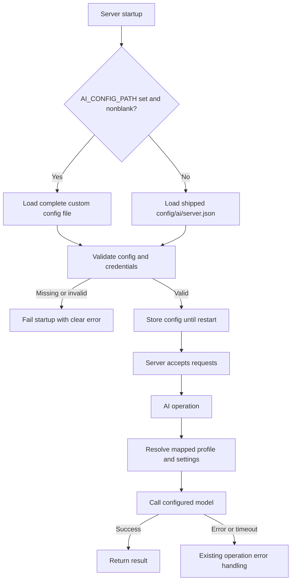

# AI configuration flow

The shipped file owns the baseline settings. A custom file replaces it entirely,
without merging or falling back to another file or hardcoded settings. Missing
required generation settings or credentials fail startup. Omitted optional
temperature, reasoning, and timeout remain absent.

Evaluations independently select `AI_EVAL_CONFIG_PATH` or the shipped
`config/ai/evaluation.baseline.json`. Validated runner overrides take precedence
over the selected evaluation file.

The dashboard retains its existing eight-second deadline and runtime fallback.
