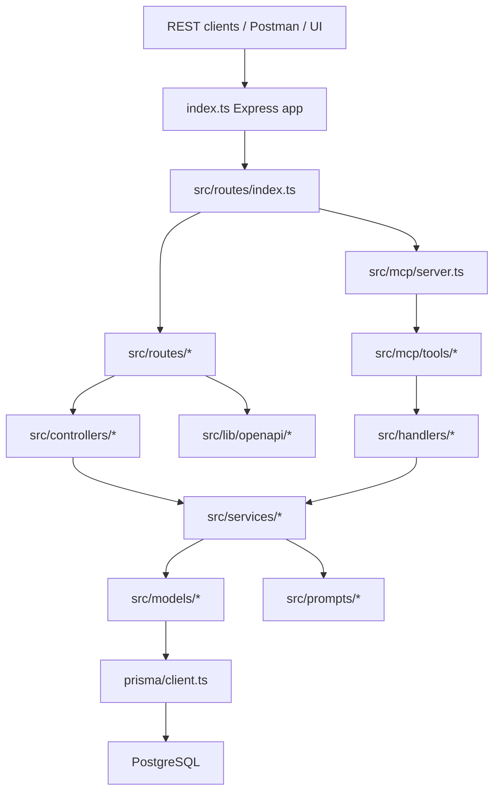

# Cartodex Map

> Auto-generated by Cartodex, a Codex port inspired by Cartographer. Last mapped: 2026-07-01T12:51:15Z

## System Overview

TestPortal-backend is a strict TypeScript, ESM, Express backend for test execution reporting, AI-assisted analysis, dashboards, PDF/export workflows, and MCP tools. The runtime has one bootstrap (`index.ts`), a central REST router (`src/routes/index.ts`), MVC-style HTTP adapters, service/model layers over Prisma/PostgreSQL, and a Streamable HTTP MCP endpoint mounted inside the same `/api` route tree.

Core domain data is project-scoped. `Project` owns executions, specs, issues, upload API keys, and daily metrics. `Execution` plus `Spec` produce `Result`; failed results can have `ResultError`; issues and result errors connect through `Assumption`. `DailyExecutionMetric` is a derived aggregate table refreshed from result data.

## Directory Structure

| Path | Purpose | Tokens |
| --- | --- | ---: |
| `index.ts` | Express bootstrap, global middleware, `/api` mount, server listen. | 318 |
| `src/routes` | Versioned REST route modules plus OpenAPI and MCP mount. | 3286 |
| `src/controllers` | HTTP request/response adapters and validation glue. | 16202 |
| `src/services` | Business logic, report ingestion, auth, dashboards, prompts, PDF/export workflows. | 34198 |
| `src/models` | Prisma persistence wrappers and manual delete ordering. | 9828 |
| `src/mcp` | MCP Streamable HTTP server, tools, schemas, middleware, and assistant prompts. | 16753 |
| `src/handlers` | Thin MCP-to-service adapters. | 1832 |
| `src/lib` | Shared helpers, OpenAPI generator modules, logging, parsing, token utilities. | 33276 |
| `src/lib/openapi` | Manually assembled OpenAPI 3.1 registrars. | 27924 |
| `src/middleware` | JWT auth, upload API key auth, multipart upload, PDF export validation, error handler. | 1234 |
| `src/schemas` | Zod schemas for REST contracts, prompt outputs, test analysis, report export. | 1830 |
| `src/prompts` | Production LLM prompt modules used by backend services. | 7038 |
| `src/skills` | Downloadable backend-owned assistant skill artifacts. | 7891 |
| `src/types` | Shared API, Prisma-shaped, MCP, CTRF, dashboard, skills, and test types. | 5251 |
| `prisma` | PostgreSQL schema, migrations, client, and persisted skill package seeder. | 13857 |
| `__tests__` | Jest unit/integration coverage for routes, controllers, services, models, middleware, lib. | 49199 |
| `__prompts-tests__` | Prompt evaluation runners, templates, dataset generators, smoke/regression tests. | 10585 |
| `docs` | Human-facing API, MCP, Docker, deploy, auth, dashboard, release, and research docs. | 29688 |
| `openspec` | Permanent specs and archived OpenSpec changes. | 16608 |
| `postman` | REST/MCP Postman collections, environment, and usage docs. | 18729 |
| `scripts` | License header and new-file automation. | 1093 |
| `.github/workflows` | Manual ECS deploy and Docker publish workflows. | 1352 |

## Module Guide

### Runtime And REST API

**Purpose**: Starts the Express app, composes REST routes, applies auth/upload/export middleware, and exposes OpenAPI docs.

**Entry point**: `index.ts`

**Key files**:

| File | Purpose | Tokens |
| --- | --- | ---: |
| `package.json` | Scripts, dependencies, package entrypoint. | 1141 |
| `tsconfig.json` | Strict TS config and path aliases. | 496 |
| `index.ts` | Express bootstrap, CORS/helmet/cookies/logging, upload JSON-parser bypass. | 318 |
| `path.config.ts` | Repo-root path constants used by logging. | 92 |
| `src/routes/index.ts` | Central router composer, `/v1` welcome, feature routers, MCP mount. | 327 |
| `src/routes/openapi.ts` | `/openapi.json` and `/swagger` docs routes. | 271 |
| `src/lib/openapi/index.ts` | Generates the OpenAPI 3.1 document from per-domain registrars. | 1017 |
| `src/config/environment.ts` | Runtime env config, app version, Cognito/LangSmith flags. | 668 |
| `src/middleware/fileUploadMiddleware.ts` | In-memory multipart upload handling. | 268 |
| `src/middleware/validatePdfExport.ts` | PDF export request validation and `res.locals.exportParams` handoff. | 298 |
| `src/controllers/jsonReportController.ts` | JSON report upload, analysis, stats refresh orchestration. | 1859 |
| `src/controllers/resultController.ts` | Result read/update/delete/export handlers. | 2052 |
| `src/controllers/userController.ts` | Signup/login/profile/integrations/MCP token handlers. | 1814 |
| `src/controllers/projectController.ts` | Project CRUD and dashboard input validation. | 1248 |
| `src/controllers/reportController.ts` | PDF streaming and timeout/error mapping. | 607 |

**Exports**: Express routers from `src/routes/*`; controller singleton/class methods; `generateOpenAPISpec()`; middleware exports including `authMiddleware`, `apiKeyMiddleware`, `uploadJsonReport`, and `validatePdfExport`.

**Dependencies**: Express, helmet, CORS, cookie-parser, multer, Zod, swagger-ui-express, JWT/user/upload services, OpenAPI registry helpers.

**Dependents**: Runtime scripts (`npm run dev`, `npm run server`), REST clients, Postman collections, tests, and MCP route composition.

### Services, Models, And Persistence

**Purpose**: Owns domain orchestration, validation, Prisma access, report ingestion, dashboard aggregation, auth/user state, upload API keys, PDF/chart generation, and AI analysis updates.

**Entry point**: Service modules are called by controllers and MCP handlers; Prisma entry is `prisma/client.ts`.

**Key files**:

| File | Purpose | Tokens |
| --- | --- | ---: |
| `prisma/schema.prisma` | Canonical PostgreSQL schema with UUID IDs and JSON payload fields. | 1674 |
| `src/services/jsonReportService.ts` | Playwright-like report ingestion and persistence. | 2219 |
| `src/services/ctrfService.ts` | CTRF transformation and ingestion path. | 1599 |
| `src/services/testAnalysisService.ts` | AI test-result analysis orchestration. | 1018 |
| `src/services/dashboardService.ts` | Daily metric refresh and dashboard reads. | 2815 |
| `src/services/resultService.ts` | Result querying, analysis feedback, deletion, JSONL export. | 2438 |
| `src/services/skillArtifactService.ts` | Skill catalog, frontmatter parsing, downloads, zip archives. | 2221 |
| `src/models/resultModel.ts` | Result Prisma queries and nested filtering. | 4278 |
| `src/lib/jsonPayloads.ts` | Normalizes JSONB/string payload fields for API compatibility. | 570 |
| `src/lib/projectCategoryWeights.ts` | Parses and normalizes project category weights. | 541 |

**Exports**: Object-style models (`projectModel`, `resultModel`, etc.); object-style services (`jsonReportService`, `dashboardService`, `resultService`, etc.); shared normalizers and category-weight helpers.

**Dependencies**: Prisma client, `@prisma/client` types, model modules, logger, parsing helpers, auth/token helpers, Argon2, Cognito, LangChain/OpenAI, chart/PDF libraries.

**Dependents**: REST controllers, MCP handlers, tests, report upload routes, dashboard/project routes, skills routes, prompt/analysis services.

### MCP, Prompts, And Skills

**Purpose**: Exposes Model Context Protocol tools and prompts over authenticated Streamable HTTP, shares service logic with REST handlers, manages production prompt modules, and packages assistant skills for download.

**Entry point**: `src/mcp/server.ts`, mounted by `src/routes/index.ts`.

**Key files**:

| File | Purpose | Tokens |
| --- | --- | ---: |
| `src/mcp/server.ts` | MCP transport/session lifecycle and tool/prompt registration. | 1761 |
| `src/mcp/helpers/mcpHelpers.ts` | Shared MCP response, error, and tool tuple helpers. | 447 |
| `src/mcp/middleware/auth.ts` | Bearer MCP token middleware. | 380 |
| `src/mcp/tools/issues.ts` | Issue MCP tool definitions. | 589 |
| `src/mcp/tools/results.ts` | Result MCP tool definitions. | 412 |
| `src/handlers/mcpResultHandler.ts` | Result MCP handler adapter. | 498 |
| `src/lib/mcp-token.ts` | HMAC-backed MCP token generation/validation. | 456 |
| `src/lib/error-analyzer.ts` | Similar-error analysis and assumption linking support. | 1466 |
| `src/prompts/stored-results-analysis/v1.1.0.ts` | Current production stored-results analysis prompt. | 2793 |
| `src/prompts/error-solution/v1.0.0.ts` | Error-solution prompt. | 635 |
| `src/skills/README.md` | Packaged skill authoring and inventory notes. | 207 |
| `__prompts-tests__/README.md` | Prompt test setup, generation, and execution guide. | 641 |

**Exports**: MCP tools for status, time, issues, results, assumptions, executions, result errors, and specs; MCP prompts for test-portal reporting, issue analysis, environment/performance, developer-code, and documentation assistance; downloadable skill artifacts.

**Dependencies**: `@modelcontextprotocol/sdk`, MCP schemas under `src/mcp/schemas`, handlers under `src/handlers`, services, Node crypto, LangChain/OpenAI, JSZip.

**Dependents**: MCP clients at `/api/v2/mcp`, `PromptParameterService`, prompt tests, user MCP-token routes, skill routes.

### Contracts And Documentation

**Purpose**: Keeps runtime behavior aligned with published REST/MCP contracts, Postman validation flows, OpenSpec specs, and operational docs.

**Entry point**: OpenAPI route plus docs and Postman collections.

**Key files**:

| File | Purpose | Tokens |
| --- | --- | ---: |
| `docs/API_DOCUMENTATION.md` | REST/OpenAPI and MCP contract guide. | 2023 |
| `docs/MCP_TOOLS.md` | MCP tool inventory and semantics. | 1922 |
| `docs/INSPECT_MCP_SERVER.md` | MCP inspector usage. | 468 |
| `docs/DEVELOPMENT_GUIDE.md` | Development workflow and troubleshooting. | 2870 |
| `docs/DOCKER.md` | Docker build/publish/run notes. | 933 |
| `docs/DEPLOY_ECS.md` | ECS deployment and migration caveats. | 1872 |
| `docs/RELEASE.md` | Release/version/tag workflow. | 473 |
| `postman` | API collections and shared environment. | 18729 |
| `openspec/specs` | Permanent accepted specs. | 3688 |

**Exports**: OpenAPI JSON/Swagger UI, Postman collections, OpenSpec permanent specs, human docs.

**Dependencies**: Runtime routes/controllers/schemas, GitHub workflows, Docker configuration, OpenSpec archive history.

**Dependents**: Developers, API consumers, release/deploy work, contract-update tasks, manual validation.

### Tests And Automation

**Purpose**: Provides regular Jest coverage, prompt evaluation suites, source header automation, local Docker stacks, and CI/deploy workflows.

**Entry point**: `package.json` scripts.

**Key files**:

| File | Purpose | Tokens |
| --- | --- | ---: |
| `jest.config.ts` | Default Jest config, excluding prompt tests. | 162 |
| `jest.prompts.config.ts` | Separate prompt-test Jest projects. | 153 |
| `eslint.config.js` | ESLint rules and TS parser setup. | 619 |
| `scripts/license-header-utils.js` | Header constants, supported extensions, replacement helpers. | 379 |
| `scripts/new-file.js` | Headered file creation CLI. | 206 |
| `Dockerfile` | Build/runtime image contract. | 352 |
| `docker-compose.yml` | Local PostgreSQL and pgAdmin stack. | 307 |
| `.github/workflows/deploy-be-ecs.yml` | Manual ECS deploy workflow. | 899 |
| `README.md` | Setup, scripts, API surface, documentation index. | 1349 |
| `CONTRIBUTING.md` | Contribution and OpenSpec workflow. | 1069 |
| `AGENTS.md` | Agent-facing repo rules and Cartodex pointer. | 861 |

**Exports**: `npm run type-check`, `npm run lint`, `npm test`, `npm run build`, `npm run new:file`, `npm run headers:add`, `npm run inspector`, Docker compose stacks, deploy/publish workflows.

**Dependencies**: ts-jest, tsx, TypeScript, ESLint, Prisma generation, Docker, AWS/GHCR workflows, OpenAI API for prompt tests.

**Dependents**: Pre-commit checklist, release process, prompt evaluation work, CI/manual deploys.

## Data Flow

### REST Request Flow

1. `index.ts` loads environment variables, constructs Express, applies helmet/CORS/cookies/logging, and mounts `/api`.
2. `src/routes/index.ts` composes `/v2` feature routers plus the MCP router.
3. Route modules apply route-local auth, API-key, upload, or PDF validation middleware.
4. Controllers normalize HTTP input and call services.
5. Services perform business logic, transactions, prompt/AI calls, aggregation, and model calls.
6. Models and direct `dbClient` calls persist through Prisma/PostgreSQL.
7. Errors may use the global `errorHandler`, but several auth/controller paths return local error envelopes.

### Report Ingestion Flow

1. JSON and CTRF uploads bypass global `express.json()` and use multipart memory storage.
2. JWT upload routes use `authMiddleware`; API-key upload routes use `apiKeyMiddleware`.
3. `jsonReportController` or `ctrfController` parses the file and passes normalized report data to services.
4. The ingestion service finds or creates `Execution` and `Spec`, creates `Result` and optional `ResultError`, then may run AI analysis.
5. Dashboard aggregates are refreshed into `DailyExecutionMetric`.

### MCP Flow

1. `POST /api/v2/mcp` passes through `authenticateMcpToken`.
2. Initialize requests create a Streamable HTTP transport and a fresh `McpServer`.
3. `src/mcp/server.ts` registers all active tools and prompts.
4. Tool calls run through `createMcpTool`, call `src/handlers/*`, and delegate to the same services used by REST.
5. Stale MCP transports are cleaned after a 30 minute timeout.

### Prompt And Skill Flow

1. Production AI services import prompt modules from `src/prompts`.
2. MCP assistant prompts live separately under `src/mcp/prompts`.
3. Prompt regression tests under `__prompts-tests__` generate datasets, call OpenAI-backed runners, and validate structured outputs.
4. Skill routes use `SkillArtifactService` to read `src/skills/*/SKILL.md`, return metadata/content, or package skill folders as zip archives.

## Conventions

- Use ES module syntax and path aliases from `tsconfig.json`.
- Keep MVC boundaries: routes wire middleware, controllers handle HTTP, services own business logic, models own Prisma access.
- Add REST contract changes in both route/controller/schema code and `src/lib/openapi/*`.
- MCP changes should follow `src/mcp/tools` -> `src/handlers` -> services, with schemas under `src/mcp/schemas`.
- Project ownership is the main tenant boundary; most domain reads and writes should be project-scoped.
- Supported source/test files in `src`, `__tests__`, and `__prompts-tests__` should carry the Apache 2.0 header.
- Create supported source files with `npm run new:file -- <path>`.
- Regular Jest tests and prompt tests are separate. `npm test` excludes `__prompts-tests__`; prompt suites use `jest.prompts.config.ts` and require generated datasets plus `OPENAI_API_KEY`.
- OpenSpec currently has permanent specs and archived changes; new spec work starts by creating an active change.

## Gotchas

- `index.ts` hardcodes multipart upload paths that skip global JSON parsing; new upload routes must be added there.
- Multipart uploads use `multer.memoryStorage()` with a 50 MB limit.
- `validatePdfExport` writes `res.locals.exportParams`; `reportController.exportPdf` depends on that exact contract.
- Auth middleware returns ad hoc 401 payloads, while the global error handler uses a different envelope.
- OpenAPI docs are regenerated on every docs request and are manually assembled.
- `src/lib/openapi/testAnalysis.ts` exists but is not registered in `src/lib/openapi/index.ts`.
- `src/mcp/tools/issues.ts` exports `getIssuesWithStats`, but `src/mcp/server.ts` does not register it.
- `src/mcp/schemas/ctrfSchemas.ts` exists, but no CTRF MCP tools are registered.
- Prompt datasets are generated artifacts and are not part of the scanner output.
- `prisma/client.ts` logs `"sqlite STARTED"` even though the datasource is PostgreSQL.
- Manual Prisma-shaped types in `src/types/database.ts` can drift from `schema.prisma`.
- Category naming is not fully unified: some code uses `infra`, while daily metrics include `issuesEnvironment`.
- `npm run inspector` points to `node build/index.js`, while the build emits and runtime uses `dist/index.js`.
- Local Docker compose uses trust auth and exposed local ports; keep that local-only.
- Migrations run at container startup in the deploy flow; rollback does not undo schema changes.

## Navigation Guide

**To add or change a REST endpoint**: Start with `src/routes/<feature>.ts`, then the matching controller/service/model. Update schemas in `src/schemas` as needed and register OpenAPI changes in `src/lib/openapi/<feature>.ts`.

**To add or change an MCP tool**: Add or update schemas in `src/mcp/schemas`, tool tuples in `src/mcp/tools`, handler adapters in `src/handlers`, and registration in `src/mcp/server.ts`. Reuse service logic where possible.

**To change report ingestion**: Inspect `src/controllers/jsonReportController.ts`, `src/controllers/ctrfController.ts`, `src/services/jsonReportService.ts`, `src/services/ctrfService.ts`, `src/services/testAnalysisService.ts`, `src/services/dashboardService.ts`, and Prisma relations in `prisma/schema.prisma`.

**To change dashboard metrics**: Inspect `src/services/dashboardService.ts`, `src/types/dashboard.ts`, `src/lib/projectCategoryWeights.ts`, and `DailyExecutionMetric` in `prisma/schema.prisma`.

**To change auth or tokens**: Inspect `src/routes/users.ts`, `src/controllers/userController.ts`, `src/services/authService.ts`, `src/services/jwtService.ts`, `src/services/userService.ts`, `src/middleware/authMiddleware.ts`, `src/lib/mcp-token.ts`, and `src/mcp/middleware/auth.ts`.

**To change upload API keys**: Inspect `src/routes/upload.ts`, `src/controllers/uploadApiKeyController.ts`, `src/services/uploadApiKeyService.ts`, `src/models/uploadApiKeyModel.ts`, and `src/middleware/apiKeyMiddleware.ts`.

**To change OpenAPI docs**: Inspect `src/lib/openapi/index.ts`, the matching registrar file, shared schemas in `src/lib/openapi/common.ts`, and route/controller request shapes.

**To change production prompts**: Inspect `src/prompts/<suite>/v*.ts`, the calling service, Zod schemas under `src/schemas`, and matching prompt tests under `__prompts-tests__` when present.

**To change downloadable skills**: Inspect `src/skills/<skill>/SKILL.md`, templates/references under that skill folder, `src/services/skillArtifactService.ts`, `src/controllers/skillController.ts`, and `src/routes/skillRoutes.ts`.

**To work on persistence or migrations**: Inspect `prisma/schema.prisma`, migrations under `prisma/migrations`, `prisma/client.ts`, affected model/service tests, and the `prisma-migration-review` skill guidance.

**To validate before PR**: Run `npm run type-check`, `npm run lint`, `npm test`, and `npm run build`. Prompt tests require their separate Jest config and OpenAI credentials.
