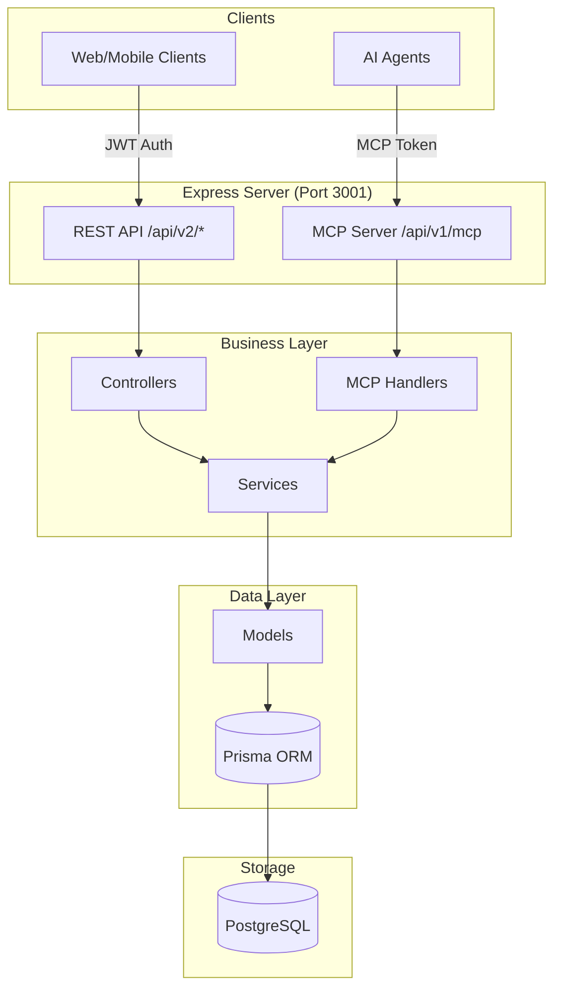
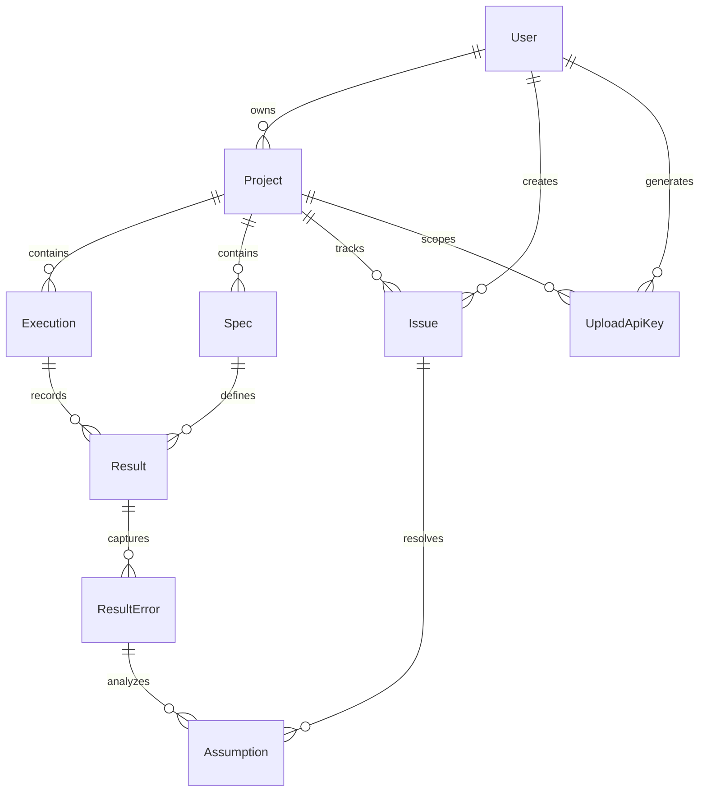
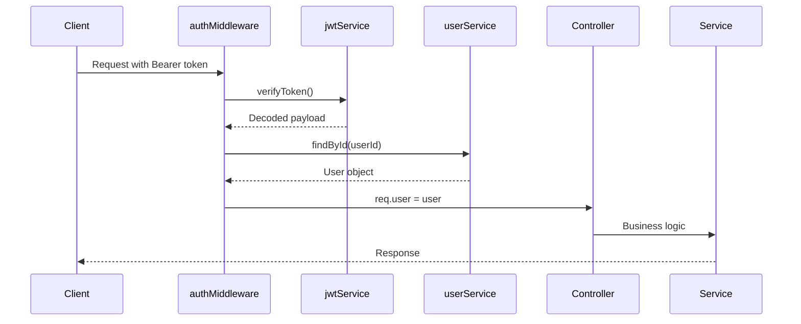
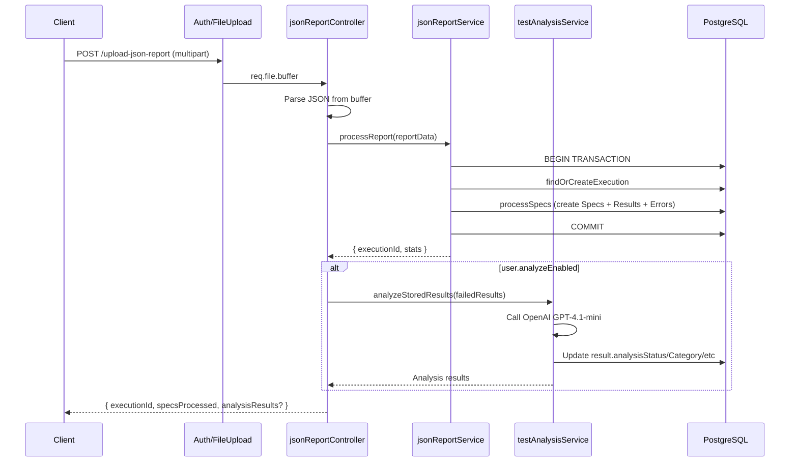
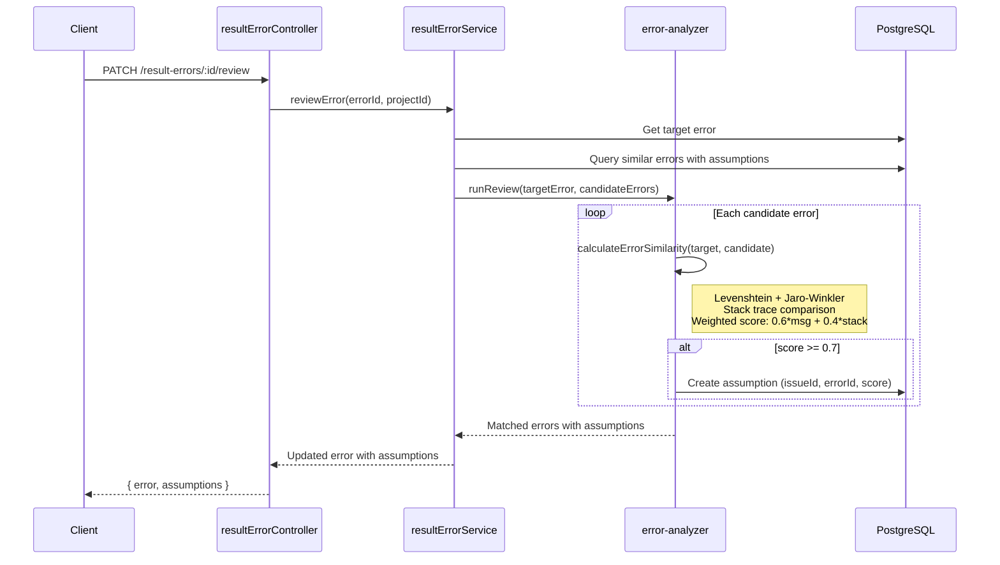
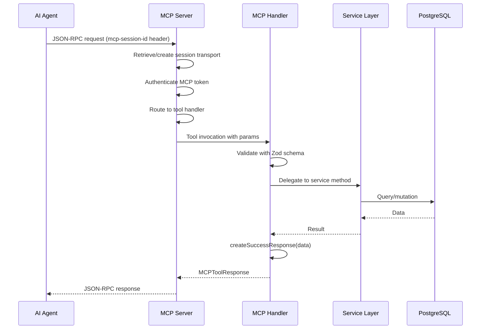

# Codebase Map

> Auto-generated by Cartographer. Last mapped: January 16, 2026

## System Overview

A **TypeScript Node.js backend** for test results management with **dual-purpose architecture**:
1. **REST API Server** - Express.js with MVC pattern for web/mobile clients
2. **MCP Tool Server** - Model Context Protocol integration for AI agent tooling

**Tech Stack:** TypeScript 5.8+, Node.js 18+, Express 5.x, Prisma ORM, PostgreSQL, Zod validation, JWT/Argon2 auth



## Directory Structure

```
test-portal-be/
├── index.ts                    # Express server entry point
├── prisma/
│   ├── schema.prisma           # Database schema (User, Project, Execution, Spec, Result, etc.)
│   ├── client.ts               # Singleton Prisma client
│   └── seed/                   # Seeding from JSON reports
├── src/
│   ├── config/                 # Environment & AWS Cognito config
│   ├── controllers/            # HTTP handlers (13 files)
│   │   ├── userController.ts
│   │   ├── projectController.ts
│   │   ├── issueController.ts
│   │   ├── resultController.ts
│   │   ├── jsonReportController.ts
│   │   └── ... (8 more)
│   ├── services/               # Pure business logic (16 files)
│   │   ├── userService.ts
│   │   ├── projectService.ts
│   │   ├── issueService.ts
│   │   ├── resultService.ts
│   │   ├── jsonReportService.ts
│   │   ├── testAnalysisService.ts
│   │   └── ... (10 more)
│   ├── models/                 # Prisma operations (9 files)
│   │   ├── userModel.ts
│   │   ├── projectModel.ts
│   │   ├── issueModel.ts
│   │   ├── resultModel.ts
│   │   └── ... (5 more)
│   ├── middleware/             # Express middleware
│   │   ├── authMiddleware.ts       # JWT verification
│   │   ├── apiKeyMiddleware.ts     # API key validation
│   │   ├── fileUploadMiddleware.ts # Multer config
│   │   └── error-handler.ts        # Global error handler
│   ├── routes/                 # Route registration (16 files)
│   │   ├── index.ts                # Aggregates all routes
│   │   ├── users.ts
│   │   ├── projects.ts
│   │   ├── json-report.ts
│   │   └── ... (12 more)
│   ├── lib/
│   │   ├── openapi/            # OpenAPI schema generation (21 files)
│   │   │   ├── index.ts            # Aggregator
│   │   │   ├── users.ts            # User schemas
│   │   │   ├── projects.ts         # Project schemas
│   │   │   ├── issues.ts           # Issue schemas
│   │   │   └── ... (17 more)
│   │   ├── error-analyzer.ts       # ML-based error similarity
│   │   ├── executionIdentifiers.ts # Fallback execution IDs
│   │   ├── mcp-token.ts            # HMAC token generation
│   │   ├── parse-error.ts          # Stack trace parsing
│   │   └── logger.ts               # log4js wrapper
│   ├── mcp/                    # MCP integration
│   │   ├── server.ts               # Session-based MCP HTTP server
│   │   ├── helpers/
│   │   │   └── mcpHelpers.ts       # Response builders
│   │   ├── middleware/
│   │   │   └── auth.ts             # MCP token authentication
│   │   ├── schemas/                # Zod validation (8 files)
│   │   ├── tools/                  # Tool definitions (8 files)
│   │   ├── prompts/                # Prompt templates (5 subdirs)
│   │   └── handlers/               # MCP-specific handlers (7 files)
│   ├── types/                  # TypeScript definitions (6 files)
│   │   ├── index.ts                # Central exports
│   │   ├── database.ts             # Prisma extensions
│   │   ├── api.ts                  # REST types
│   │   ├── mcp.ts                  # MCP types
│   │   └── ... (2 more)
│   └── schemas/                # Zod validation (3 files)
├── __tests__/                  # Jest tests (16 files)
│   ├── services/               # Service unit tests (7 files)
│   ├── routes/                 # Route integration tests (3 files)
│   ├── controllers/            # Controller tests (1 file)
│   └── lib/                    # Utility tests (5 files)
├── docs/                       # Documentation (13 markdown files)
├── .claude/                    # Claude Code agent configs
└── ... (config files)
```

## Module Guide

### 1. Entry Point & Configuration

| File | Purpose | Key Exports | Tokens |
|------|---------|-------------|--------|
| `index.ts` | Express server bootstrap | None (entry point) | 318 |
| `package.json` | NPM manifest, scripts | N/A | 990 |
| `tsconfig.json` | TypeScript config with path aliases | N/A | 487 |
| `docker-compose.yml` | PostgreSQL + pgAdmin setup | N/A | 313 |

**Entry Point Flow:**
1. Load environment variables
2. Initialize Prisma client
3. Setup Express middleware (helmet, cors, cookie-parser)
4. Register all routes via `@/routes/index`
5. Attach global error handler
6. Listen on port 3001

**Path Aliases (Critical):**
- `@/*` → `src/*`
- Used everywhere, never relative imports
- Requires `tsc-alias` post-build step

---

### 2. Database Layer (Prisma)

| File | Purpose | Key Models | Tokens |
|------|---------|-----------|--------|
| `prisma/schema.prisma` | Complete data model | User, Project, Execution, Spec, Result, ResultError, Issue, Assumption, UploadApiKey | 1421 |
| `prisma/client.ts` | Singleton Prisma client | `dbClient` | 165 |
| `prisma/seed/index.js` | Seed from JSON files | N/A | 731 |

**Database Schema Relationships:**



**Key Database Patterns:**
- All IDs are UUIDs
- Cascade deletes on project removal (8-step process)
- JSON fields: tags, annotations, callLog, callStack (stored as strings)
- Unique constraints: spec key per project, user email, API keys
- Optional AI fields: analysisStatus, analysisCategory, analysisConfidence, analysisConclusion, analysisErrorQuality

---

### 3. Models Layer (`src/models/`)

**Purpose:** Database access layer using Prisma ORM

| Model | Purpose | Key Methods | Tokens |
|-------|---------|-------------|--------|
| `userModel.ts` | User CRUD | `findById`, `findByEmail`, `findByCognitoUserId`, `create`, `update` | 417 |
| `projectModel.ts` | Project CRUD + cascade | `findMany`, `findById`, `create`, `deleteWithCascade`, `findUserProjects` | 1691 |
| `issueModel.ts` | Issue operations | `findMany`, `findManyWithUsers`, `count`, `create`, `update`, `delete` | 906 |
| `resultModel.ts` | Complex result queries | `findMany` (with filters), `getStats`, `updateAnalysis`, `delete` | 3392 |
| `resultErrorModel.ts` | Error operations | `findById`, `assignIssue` | 271 |
| `executionModel.ts` | Execution queries | `findById`, `findMany`, `delete` (cascading) | 524 |
| `specModel.ts` | Spec operations | `findById`, `delete` (cascading) | 319 |
| `assumptionModel.ts` | Assumption CRUD | `create`, `update`, `delete`, `findById` | 360 |
| `uploadApiKeyModel.ts` | API key management | `create`, `findByApiKey`, `findAllActive`, `revoke` | 446 |

**Pattern:** Models use Prisma client for all DB operations, include relations via `include`, support optional transaction client parameter.

**Gotcha:** `resultModel.findMany` has complex filtering logic for `reviewStatus`: "completed" = passed OR all assumptions confirmed; "incompleted" = failed AND (no assumptions OR some unconfirmed).

---

### 4. Services Layer (`src/services/`)

**Purpose:** Pure business logic without HTTP concerns (reused by both REST and MCP)

| Service | Purpose | Key Methods | Tokens |
|---------|---------|-------------|--------|
| `userService.ts` | User auth & profile | `signup`, `login`, `refreshTokens`, `signupWithCognito`, `generateMcpToken`, `updateUserIntegrations` | 2806 |
| `projectService.ts` | Project management | `findMany`, `findById`, `create`, `update`, `deleteWithCascade` | 437 |
| `issueService.ts` | Issue management + stats | `getAllIssues`, `getAllIssuesWithStats` (with time distributions), `create`, `update` | 2561 |
| `resultService.ts` | Result queries | `getResults` (extensive filtering), `getResultsStats`, `updateAnalysis` | 1146 |
| `resultErrorService.ts` | Error analysis | `assignIssue`, `reviewError` (ML-based), `bulkReview`, `getResultErrorById` | 972 |
| `jsonReportService.ts` | Report processing | `processReport` (transaction-based), `_findOrCreateExecution`, `_processSpecs`, `_createResultRecord` | 2176 |
| `ctrfService.ts` | CTRF format processing | `processReport`, `transformCtrfToReportData` | 1279 |
| `testAnalysisService.ts` | AI test analysis | `analyzeStoredResults` (OpenAI GPT-4.1-mini) | 992 |
| `uploadApiKeyService.ts` | API key lifecycle | `generateApiKey` (HMAC-based), `validateApiKey`, `revokeKey` | 1543 |
| `jwtService.ts` | JWT operations | `generateAccessToken` (7d), `generateRefreshToken` (30d), `verifyToken` | 637 |

**Pattern:** Services accept typed parameters, return typed responses, throw errors for exceptional cases. Controllers convert errors to HTTP status codes.

**Key Data Flow (Report Upload):**
1. `jsonReportService.processReport` receives report object
2. Uses transaction for atomicity
3. `_findOrCreateExecution` creates/finds execution by runId
4. `_processSpecs` iterates through test specs
5. `_createResultRecord` creates result + errors
6. Optional: `testAnalysisService.analyzeStoredResults` if `user.analyzeEnabled`

---

### 5. Controllers Layer (`src/controllers/`)

**Purpose:** HTTP handlers that delegate to services

| Controller | Purpose | Key Methods | Tokens |
|------------|---------|-------------|--------|
| `userController.ts` | User endpoints | `signup`, `login`, `refreshToken`, `cognitoSignup`, `generateMcpToken`, `updateUserIntegrations` | 1794 |
| `projectController.ts` | Project CRUD | `getAllProjects`, `getProjectById`, `createProject`, `updateProject`, `deleteProject` | 998 |
| `issueController.ts` | Issue management | `getAllIssues`, `getAllIssuesV2` (with user serialization), `getAllIssuesWithStats`, CRUD methods | 1857 |
| `resultController.ts` | Result queries | `getResults` (with `buildResultParams`), `getResultsStats`, `updateAnalysis` | 1154 |
| `resultErrorController.ts` | Error management | `assignIssue`, `reviewError`, `bulkReview`, `getResultErrorById` | 711 |
| `jsonReportController.ts` | Report upload | `_processRawReportFileCore` (JWT + API key variants), `_transformRawReport`, `_getTestCases` | 1713 |
| `ctrfController.ts` | CTRF upload | `processRawReportFile`, `processRawReportFileWithApiKey` | 682 |

**Pattern:** Controllers extract params from `req.query`/`req.body`/`req.params`, call service, format response with appropriate status code.

**Gotcha:** V2 issue endpoints include serialized user info (`createdBy`, `updatedBy`); automatically set `createdById`/`updatedById` from `req.user.id`.

---

### 6. Middleware (`src/middleware/`)

| Middleware | Purpose | Dependencies | Tokens |
|------------|---------|--------------|--------|
| `authMiddleware.ts` | JWT authentication | `jwtService`, `userService` | 234 |
| `apiKeyMiddleware.ts` | API key validation | `uploadApiKeyService` | 202 |
| `fileUploadMiddleware.ts` | Multer config | `multer` | 147 |
| `error-handler.ts` | Global error handler | `logger` | 142 |

**Authentication Flow (JWT):**


---

### 7. Routes Layer (`src/routes/`)

**Purpose:** Express route registration

| Route File | Endpoints | Middleware | Tokens |
|------------|-----------|------------|--------|
| `index.ts` | Aggregates all routes | N/A | 261 |
| `users.ts` | `/v2/users/*` | authMiddleware (most) | 241 |
| `projects.ts` | `/v2/projects/*` | authMiddleware (all) | 169 |
| `json-report.ts` | `/v2/upload-json-report*` | authMiddleware OR apiKeyMiddleware + fileUploadMiddleware | 158 |
| `ctrf.ts` | `/v2/upload-ctrf-report*` | authMiddleware OR apiKeyMiddleware + fileUploadMiddleware | 152 |
| `issue.ts` | `/v2/issues/*` | authMiddleware (all) | 171 |
| `results.ts` | `/v2/results/*` | authMiddleware (all) | 127 |
| `openapi.ts` | `/openapi.json` | None | 131 |

**Public Routes:**
- `GET /v2/status` - Health check
- `POST /v2/users/signup` - User registration
- `POST /v2/users/login` - Authentication
- `POST /v2/users/refresh-token` - Token refresh
- `GET /openapi.json` - OpenAPI spec

**Protected Routes (JWT):**
- All `/v2/users/:userId/*` except signup/login/refresh
- All `/v2/projects/*`
- All `/v2/issues/*`
- All `/v2/results/*`
- All `/v2/upload-json-report` (JWT variant)

**Protected Routes (API Key):**
- `POST /v2/upload-json-report-api-key`
- `POST /v2/upload-ctrf-report-api-key`

---

### 8. OpenAPI System (`src/lib/openapi/`)

**Purpose:** Zod schemas + OpenAPI 3.1.0 spec generation

| File | Purpose | Schemas | Tokens |
|------|---------|---------|--------|
| `index.ts` | Aggregator, generates spec | N/A | 890 |
| `users.ts` | User schemas | `UserSchema`, `UserUpdateRequestSchema`, `McpTokenResponseSchema` | 1739 |
| `projects.ts` | Project schemas | `ProjectSchema`, `CreateProjectRequestSchema` | 1417 |
| `issues.ts` | Issue schemas | `IssueSchema`, `CreateIssueRequestSchema` | 2104 |
| `results.ts` | Result schemas | `ResultSchema`, `ResultsStatsSchema`, `UpdateResultAnalysisRequestSchema` | 1996 |
| `reports.ts` | Report schemas | `JsonReportRequestSchema`, `JsonReportResponseSchema` | 1237 |
| `ctrf.ts` | CTRF format schemas | `CTRFReportRequestSchema`, `CTRFTestSchema` | 1873 |
| `auth.ts` | Auth schemas | `UserSignupRequestSchema`, `UserLoginResponseSchema` | 813 |
| `prompts.ts` | Prompt schemas | `PromptConfigSchema`, `GeneratePromptRequestSchema` | 1201 |

**Pattern:** Each file defines Zod schemas with `.openapi()` extensions for documentation, registers routes with tags/security, exports registration function.

**Gotcha:** Single source of truth for both validation (Zod at runtime) and documentation (OpenAPI spec generation).

---

### 9. MCP Integration (`src/mcp/`)

**Purpose:** Model Context Protocol server for AI agent tooling

#### **Server (`src/mcp/server.ts`)** - 1713 tokens
**Architecture:**
- Session-based HTTP transport
- 30-minute session timeout with cleanup interval
- Separate `McpServer` instance per session
- Registers 13 tools + 5 prompts on initialization

**Registered Tools:**
- `status-check`, `current-time`
- Issues: `get-issues`, `get-issue-by-id`, `create-issue`
- Results: `get-results`, `get-result-by-id`, `get-results-stats`
- Assumptions: `create-assumption`, `update-assumption`, `get-assumption-by-id`
- Errors: `assign-issue`, `review-error`, `bulk-review`, `get-result-error-by-id`
- Executions: `get-execution-by-id`
- Specs: `get-spec-by-id`

**Registered Prompts:**
- `test-portal-assistant` - Test reporting with time periods
- `issue-analysis-assistant` - Error analysis scoped by system
- `environment-performance-assistant` - Performance metrics
- `developer-code-assistant` - Code debugging context
- `documentation-architect` - Documentation generation

**Gotcha:** Session ID passed via `mcp-session-id` header; new sessions require `InitializeRequest`.

#### **Helpers (`src/mcp/helpers/mcpHelpers.ts`)** - 424 tokens
**Exports:**
- `createSuccessResponse(data, message?)` - Standard success format
- `createErrorResponse(operation, error)` - Standard error format
- `withErrorHandling(handler, operation)` - Wraps handler with try/catch
- `createMcpTool(name, description, schema, handler, operation)` - Tool factory

**Pattern:** All MCP tools should use `createMcpTool` for consistency.

#### **Tools (`src/mcp/tools/*.ts`)** - 8 files
**Pattern:** Each file exports tool definitions as tuples: `[name, description, schema, handler]`

**Example (issues.ts):**
```typescript
export const getIssues = createMcpTool(
  "get-issues",
  "Get all issues with optional filtering",
  getIssuesSchema,
  async (params) => {
    const issues = await mcpIssueHandler.getAllIssues(params);
    return createSuccessResponse(issues);
  },
  "Get Issues"
);
```

#### **Prompts (`src/mcp/prompts/*.ts`)** - 5 subdirectories
**Pattern:** Versioned prompt templates (v1.0.0)

**Example (test-portal-assistant):**
- Parameters: `time_period`, `report_type`, `project_system`
- Returns: GetPromptResult with formatted prompt messages
- Use case: AI agents querying test reports

#### **Handlers (`src/handlers/mcp*.ts`)** - 7 files
**Purpose:** MCP-specific business logic wrappers (delegate to services)

| Handler | Purpose | Methods | Tokens |
|---------|---------|---------|--------|
| `mcpIssueHandler.ts` | Issue operations | `getAllIssues`, `getAllIssuesWithStats`, `getIssueById`, `createIssue`, `updateIssue` | 619 |
| `mcpResultHandler.ts` | Result operations | `getResults`, `getResultById`, `getResultsStats` | 464 |
| `mcpResultErrorHandler.ts` | Error management | `assignIssue`, `reviewError`, `bulkReview`, `getResultErrorById` | 241 |
| `mcpAssumptionHandler.ts` | Assumption CRUD | `createAssumption`, `updateAssumption`, `getAssumptionById` | 223 |

**Pattern:** Direct delegation to service layer with parameter filtering.

---

### 10. Utilities (`src/lib/`)

| Utility | Purpose | Key Functions | Tokens |
|---------|---------|---------------|--------|
| `error-analyzer.ts` | ML-based error similarity | `runReview`, `calculateErrorSimilarity`, `compareStackTraces` | 1465 |
| `executionIdentifiers.ts` | Fallback execution IDs | `generateFallbackIdentifier` (3 strategies) | 874 |
| `mcp-token.ts` | HMAC token generation | `generateMcpToken`, `verifyMcpToken` | 433 |
| `parse-error.ts` | Stack trace parsing | `parseStackTrace` | 695 |
| `logger.ts` | log4js wrapper | `getLogger` | 186 |
| `params-builder.ts` | Query param builders | `buildIssueParams`, `buildResultParams` | 407 |

**Error Analyzer Algorithm:**
1. Normalize error messages (remove numbers)
2. Calculate Levenshtein + Jaro-Winkler similarity (message score)
3. Compare stack traces: Jaccard + sequence similarity (stack score)
4. Weighted final score: 0.6 * message + 0.4 * stack
5. Match if score >= 0.7, auto-create assumption

---

### 11. Types (`src/types/`)

| File | Purpose | Key Exports | Tokens |
|------|---------|-------------|--------|
| `index.ts` | Central exports | Barrel export pattern | 440 |
| `database.ts` | Prisma extensions | `Prisma*` types, `*WithRelations`, `SerializedUser` | 1470 |
| `api.ts` | REST types | Request/response interfaces | 603 |
| `mcp.ts` | MCP types | `MCPToolResponse`, `MCPToolHandler` | 316 |
| `tests.ts` | Test types | Mirrors DB schema with parsed JSON | 680 |
| `ctrf.ts` | CTRF format | Industry-standard test report format | 299 |

**Pattern:** Single import point for all types via `src/types/index.ts`.

---

## Data Flow Diagrams

### Report Upload Flow



### Error Review Flow (ML-Based)



### MCP Tool Execution Flow



---

## Navigation Guide

### To add a new REST endpoint:
1. **Schema:** Define Zod schema in `src/lib/openapi/{domain}.ts`
2. **Route:** Register route in `src/routes/{domain}.ts`
3. **Controller:** Add method to `src/controllers/{domain}Controller.ts`
4. **Service:** Add business logic to `src/services/{domain}Service.ts`
5. **Model:** Add DB operation to `src/models/{domain}Model.ts` (if needed)

### To add a new MCP tool:
1. **Schema:** Define Zod schema in `src/mcp/schemas/{domain}Schemas.ts`
2. **Handler:** Add method to `src/handlers/mcp{Domain}Handler.ts`
3. **Tool:** Create tool definition in `src/mcp/tools/{domain}.ts` using `createMcpTool`
4. **Register:** Add tool to `src/mcp/server.ts` tool registration

### To modify database schema:
1. **Schema:** Update `prisma/schema.prisma`
2. **Migration:** Run `npm run migrate`
3. **Types:** Update `src/types/database.ts` if adding custom types
4. **Model:** Update corresponding model in `src/models/`

### To add AI analysis:
1. **Prompt:** Create prompt in `src/prompts/{feature}/v1.0.0.ts`
2. **Schema:** Define Zod schema in `src/schemas/{feature}Schemas.ts`
3. **Service:** Add analysis logic to `src/services/{feature}Service.ts` using LangChain
4. **Controller:** Call service from controller if user has `analyzeEnabled`

### To add authentication:
- **JWT:** Use `authMiddleware` in route registration
- **API Key:** Use `apiKeyMiddleware` for upload endpoints
- **MCP Token:** Use `authenticateMcpToken` for MCP server

---

## Conventions & Gotchas

### Service Layer
✅ **DO:** Pure functions, no req/res objects, throw errors
✅ **DO:** Accept typed parameters, return typed responses
✅ **DO:** Support optional transaction client parameter
❌ **DON'T:** Include HTTP logic, status codes, or response formatting

### Path Aliases
✅ **DO:** Always use `@/` imports
❌ **DON'T:** Use relative paths like `../../models/userModel`

### Database
- **All IDs are UUIDs** (except Result which uses custom string ID)
- **Project scoping:** Most queries require `projectId` for ownership verification
- **Cascade deletes:** Deleting project removes all children in strict order (8 steps)
- **JSON fields:** tags, annotations, callLog, callStack stored as strings, deserialized in models
- **Unique constraints:** Spec key per project, user email, API keys

### Authentication
- **Three auth methods:** JWT (REST), MCP token (MCP), API key (uploads)
- **JWT tokens:** Access (7 days) + refresh (30 days), requires `JWT_SECRET` env var
- **MCP tokens:** Never expire, manually revoked, HMAC-based, requires `MCP_SECRET` env var
- **API keys:** Hashed in DB, project-scoped, self-contained HMAC tokens

### MCP Integration
- **Session-based:** 30-minute timeout with cleanup interval
- **Tools:** kebab-case names (e.g., `get-issues`, `create-assumption`)
- **Prompts:** Versioned in subdirectories (v1.0.0)
- **Handlers:** Delegate to service layer, no direct DB access

### Error Handling
- **Controllers:** Return appropriate HTTP status codes (400, 401, 404, 500)
- **Services:** Throw descriptive errors, caught by controllers
- **MCP:** Use `createErrorResponse` helper for standardized error format

### Testing
- **Service tests:** Mock Prisma client
- **Route tests:** Use supertest for HTTP requests
- **Library tests:** Focus on pure functions
- **Path aliases:** Configure via `jest.config.ts` moduleNameMapper

---

## Performance & Scaling

### Database Indexes
- `User`: email, cognitoUserId
- `Project`: name, ownerId
- `Execution`: projectId, environment, type, startedAt
- `Spec`: projectId, file, title, unique(projectId + key)
- `Issue`: projectId, category, createdAt
- `UploadApiKey`: projectId, ownerId, apiKey

### Query Optimization
- **resultModel.findMany:** Supports extensive filtering with Prisma `where` clauses
- **resultModel.getStats:** Uses Maps for deduplication, calculates top 10 errors/issues
- **issueService stats:** Time distributions calculated by date, unique tests via Set

### Caching
- **Prisma:** No built-in query caching (consider Redis for high-traffic)
- **MCP Sessions:** In-memory storage with 30-minute timeout

### File Uploads
- **Memory storage:** Files stored in `req.file.buffer` (max 10MB)
- **Large reports:** Supported via multipart/form-data, no streaming (consider chunked uploads for >100MB)

---

## Environment Variables

**Required:**
- `DATABASE_URL` - PostgreSQL connection string
- `JWT_SECRET` - JWT signing key
- `MCP_SECRET` - MCP token signing key
- `API_KEY_SECRET` - API key HMAC secret

**Optional:**
- `PORT` - Server port (default: 3001)
- `LOG_LEVEL` - Logging level (default: info)
- `LOGS_DIR` - Log file directory (default: ./logs)
- `OPENAI_API_KEY` - For AI analysis features
- `AWS_COGNITO_*` - For Cognito authentication

---

## Development Commands

```bash
# Development
npm run dev                    # Start with hot reload (nodemon + tsx)
npm run build                  # TypeScript build with tsc-alias
npm run server                 # Run production build
npm run type-check             # TypeScript compilation check
npm run lint                   # ESLint validation
npm run format                 # Prettier formatting

# Testing
npm test                       # Run Jest tests with ts-jest

# Database
npm run migrate                # Prisma migration
npm run seed                   # Seed database with JSON examples
npm run seed:migrate           # Migrate from SQLite to PostgreSQL
npm run studio                 # Open Prisma Studio

# MCP Development
npm run inspector              # MCP inspector on port 6274
```

---

## Related Documentation

- [APPLICATION_OVERVIEW.md](APPLICATION_OVERVIEW.md) - High-level architecture
- [DEVELOPMENT_GUIDE.md](DEVELOPMENT_GUIDE.md) - Setup and patterns
- [API_DOCUMENTATION.md](API_DOCUMENTATION.md) - REST API reference
- [MCP_TOOLS.md](MCP_TOOLS.md) - MCP tool catalog
- [JWT_AUTH.md](JWT_AUTH.md) - Authentication flows
- [POSTGRES_SETUP.md](POSTGRES_SETUP.md) - Database setup
- [DOCKER.md](DOCKER.md) - Docker deployment

---

**Generated by Cartographer** | Total Files: 255 | Total Tokens: 204,786
