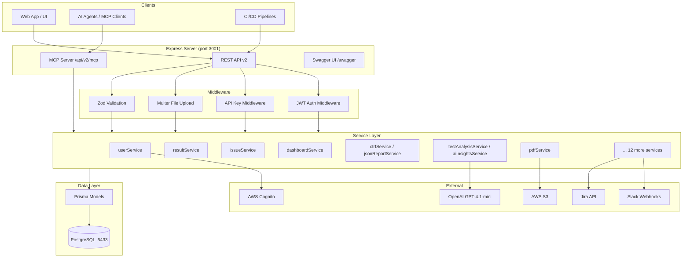
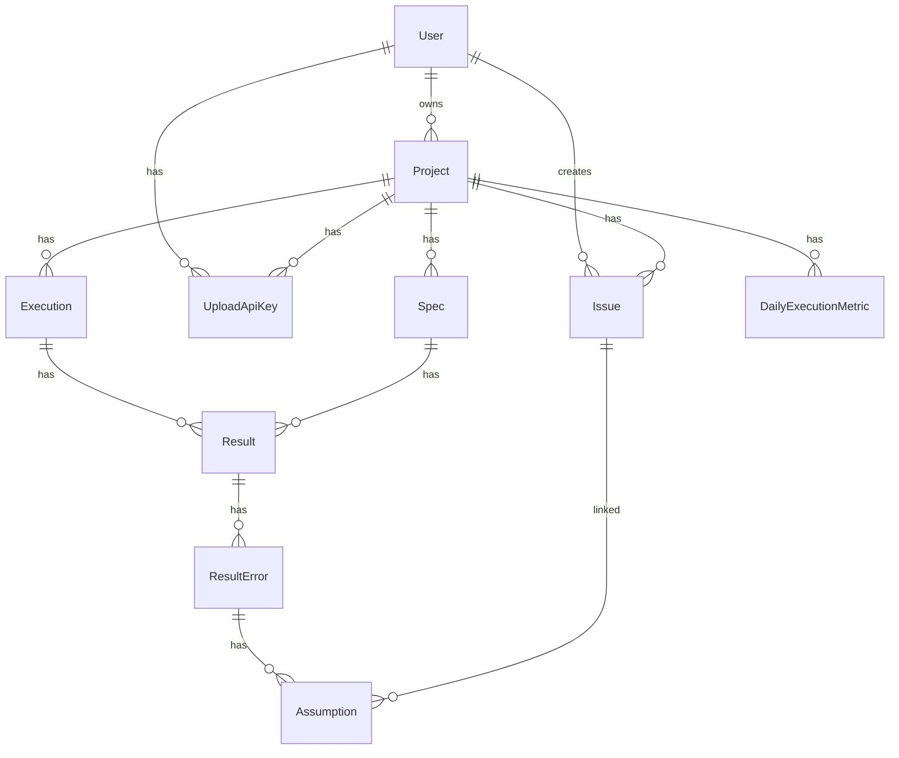
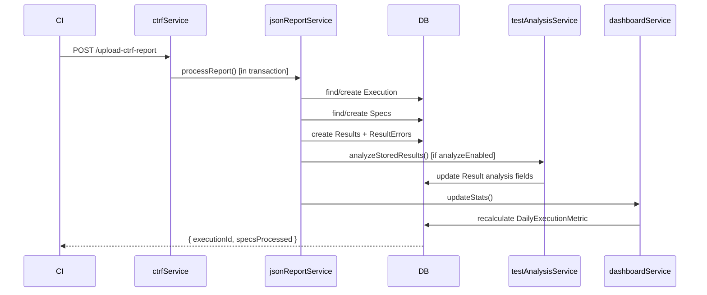
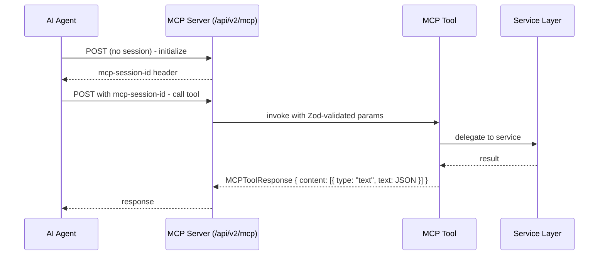
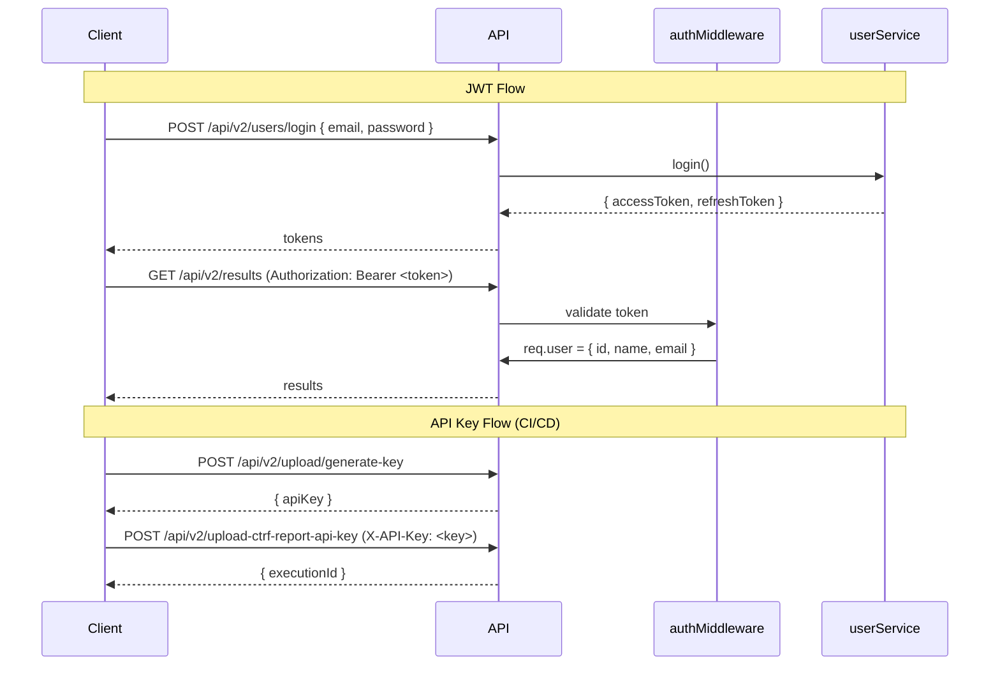

# Codebase Map

> Auto-generated by Cartographer. Last mapped: 2026-03-06

## System Overview



## Directory Structure

```
test-portal-be/
├── index.ts                    # Express app entry point
├── prisma/
│   ├── schema.prisma           # Database schema (10 models)
│   ├── migrations/             # 30 migration files
│   └── seed/                   # Seed data + example CTRF reports
├── src/
│   ├── config/                 # Environment + Cognito config
│   ├── controllers/            # HTTP request handlers (14 controllers)
│   ├── handlers/               # MCP-specific request handlers (6 handlers)
│   ├── lib/                    # Utilities: error-analyzer, mcp-token, openapi schemas
│   │   └── openapi/            # 19 OpenAPI schema modules
│   ├── mcp/
│   │   ├── server.ts           # MCP HTTP transport server
│   │   ├── helpers/            # createMcpTool, response helpers
│   │   ├── tools/              # 8 MCP tool modules
│   │   └── prompts/            # 5 AI assistant prompt templates
│   ├── middleware/             # auth, apiKey, upload, validation, error handler
│   ├── models/                 # Prisma wrappers (9 model modules)
│   ├── prompts/                # AI prompt content (error-solution, test-insight, ai-insights)
│   ├── routes/                 # Route registrations (18 route modules)
│   ├── schemas/                # Zod validation schemas
│   ├── services/               # Business logic (22 services)
│   ├── test-utils/             # httpMocks, testEnv helpers
│   └── types/                  # TypeScript types (central exports)
├── __tests__/                  # Unit + integration tests (31 test files)
│   ├── services/               # Service layer tests (12 files)
│   ├── controllers/            # Controller tests (4 files)
│   ├── routes/                 # Route integration tests (3 files)
│   ├── lib/                    # Utility tests (5 files)
│   └── middleware/             # Middleware tests
├── __mocks__/                  # Manual mocks (argon2, path.config)
├── __prompts-tests__/          # LLM prompt evaluation tests
├── docs/                       # Documentation (23 markdown files)
├── .github/                    # GitHub Actions workflows + agent configs
├── .claude/                    # Claude Code agents and settings
├── docker-compose.yml          # PostgreSQL + PgAdmin services
└── postman/                    # Postman collections
```

## Module Guide

### Entry Point

**File:** `index.ts`
**Purpose:** Express app configuration and startup
**Key behavior:**
- Applies global middleware: helmet, CORS, cookie-parser, logging, error handler
- Skips JSON body parsing for upload routes (multer handles those)
- Listens on `PORT` (default: 3001)

---

### Config (`src/config/`)

| File | Purpose |
|------|---------|
| `environment.ts` | Centralizes all env vars; exposes `isCognitoConfigured`, `isLangSmithConfigured` flags |
| `cognitoConfig.ts` | Creates CognitoUserPool instance (or null if not configured) |

---

### Middleware (`src/middleware/`)

| File | Purpose |
|------|---------|
| `auth.ts` | JWT Bearer token validation; attaches `req.user` |
| `apiKeyMiddleware.ts` | X-API-Key header validation; attaches `req.apiKey` |
| `fileUploadMiddleware.ts` | Multer config: memory storage, JSON-only, 50MB limit |
| `validatePdfExport.ts` | Zod validation for PDF export params; attaches to `res.locals.exportParams` |
| `error-handler.ts` | Global error handler; returns `{ success: false, error: { message, status } }` |

---

### Database Models (`src/models/`)

10 Prisma models representing the full domain:



| Model | Key Fields | Notes |
|-------|-----------|-------|
| `User` | email (unique), passwordHash, mcpToken, cognitoUserId | Email restricted to @ventionteams.com |
| `Project` | name (unique), ownerId, isActive | Cascading delete via `deleteWithCascade()` |
| `Execution` | type, environment, version, startedAt, projectId | Indexed by projectId+env, projectId+type |
| `Spec` | key, file, title, tags, projectId | Unique: projectId+key |
| `Result` | status, retry, startTime, analysisStatus/Category/Confidence... | Rich AI analysis fields |
| `ResultError` | type, message, callStack, callLog, location | callStack/callLog stored as JSON strings |
| `Assumption` | isConfirmed, score, madeBy, issueId, resultErrorId | Setting isConfirmed=false DELETES the assumption |
| `Issue` | name, category, ticket, portal, service, projectId | createdById/updatedById tracked |
| `UploadApiKey` | apiKey (unique), isActive, projectId | Alternative auth for CI uploads |
| `DailyExecutionMetric` | date, environment, type, totalTests/passed/failed... | Unique: projectId+env+type+date; idempotent recalc |

---

### Services (`src/services/`)

Services contain **pure business logic** — no HTTP req/res objects.

**Core Business Services:**

| Service | Purpose | Key Methods |
|---------|---------|-------------|
| `userService` | User lifecycle + auth | signup, login, generateMcpToken, updateUserIntegrations |
| `authService` | AWS Cognito integration | signUpUser, signInUser, signOutUser |
| `projectService` | Project CRUD | createProject, deleteProject (cascading) |
| `resultService` | Result queries + analysis | getResults (complex filters), updateAnalysis, exportAnalysisJsonl |
| `issueService` | Issue management | getAllIssuesWithStats (occurrence/time distribution) |
| `assumptionService` | Error→issue hypothesis | createAssumption, updateAssumption (isConfirmed=false deletes) |
| `executionService` | Execution management | deleteExecution (cascades + refreshes dashboard) |
| `dashboardService` | Aggregated metrics | updateStats (idempotent), getDashboard |

**Report Ingestion Services:**

| Service | Purpose |
|---------|---------|
| `ctrfService` | Transform CTRF format → internal format; skips analysis if >50% non-passing |
| `jsonReportService` | Core ingestion: find/create Execution+Spec, create Results+ResultErrors |
| `testAnalysisService` | Post-persist AI analysis via OpenAI GPT-4.1-mini (LangChain structured output) |

**Integration Services:**

| Service | Purpose |
|---------|---------|
| `pdfService` | Generate PDF reports with charts |
| `s3Service` | AWS S3 file operations |
| `slackService` | Slack webhook notifications |
| `jiraService` | Jira ticket integration |
| `emailService` | Email notifications |
| `webhookService` | Generic webhook delivery |
| `aiInsightsService` | AI-powered insights generation |

**Data Flow: Report Ingestion**



---

### Controllers (`src/controllers/`)

14 controllers — handle HTTP concerns and delegate to services.

| Controller | Routes Served | Key Responsibility |
|-----------|--------------|-------------------|
| `userController` | /v2/users | Auth, MCP token management |
| `projectController` | /v2/projects | Project CRUD |
| `resultController` | /v2/results | Result queries, analysis updates, JSONL export |
| `issueController` | /v2/issues | Issue CRUD + statistics |
| `assumptionController` | /v2/assumptions | Assumption lifecycle |
| `executionController` | /v2/executions | Execution get/delete |
| `dashboardController` | /v2/projects/:id/dashboard | Dashboard metrics |
| `ctrfController` | /v2/upload-ctrf-report | CTRF report ingestion |
| `authController` | /v2/users/signup, login | Local + Cognito auth |
| `workspaceController` | /v2/workspaces | Workspace management |
| `environmentController` | /v2/environments | Environment management |
| `summaryController` | /v2/summary | Summary data |

---

### Routes (`src/routes/`)

All routes prefixed with `/api`. Current version: `v2`.

**Complete REST API Surface:**

```
# Authentication
POST   /api/v2/users/signup
POST   /api/v2/users/login
POST   /api/v2/users/signout
POST   /api/v2/users/refresh-token

# Users (protected)
GET    /api/v2/users/:userId
PATCH  /api/v2/users/:userId
PATCH  /api/v2/users/:userId/integrations
POST   /api/v2/users/:userId/mcp-token
DELETE /api/v2/users/:userId/mcp-token

# Projects (protected)
GET    /api/v2/projects
GET    /api/v2/projects/:id
POST   /api/v2/projects
PUT    /api/v2/projects/:id
DELETE /api/v2/projects/:id
GET    /api/v2/projects/:projectId/dashboard

# Results (protected)
GET    /api/v2/results
GET    /api/v2/results/:resultId
GET    /api/v2/results-stats
PATCH  /api/v2/results/:resultId/analysis
PATCH  /api/v2/results/:resultId/analysis-feedback
DELETE /api/v2/results/:resultId

# Issues (protected)
GET    /api/v2/issues
GET    /api/v2/issues/with-stats
GET    /api/v2/issues/:issueId
POST   /api/v2/issues
PATCH  /api/v2/issues/:issueId
DELETE /api/v2/issues/:issueId

# Assumptions (protected)
POST   /api/v2/assumptions
GET    /api/v2/assumptions/:assumptionId
PATCH  /api/v2/assumptions/:assumptionId
DELETE /api/v2/assumptions/:assumptionId

# Executions (protected)
GET    /api/v2/executions/:executionId
DELETE /api/v2/executions/:executionId

# Specs (protected)
GET    /api/v2/specs/:specId
DELETE /api/v2/specs/:specId

# Result Errors (protected)
GET    /api/v2/result-errors/:resultErrorId
PATCH  /api/v2/result-errors/:resultErrorId/assign-issue
PATCH  /api/v2/result-errors/:resultErrorId/review
PATCH  /api/v2/result-errors/bulk-review
POST   /api/v2/result-errors/analyze

# File Upload
POST   /api/v2/upload-json-report          (JWT auth)
POST   /api/v2/upload-json-report-api-key  (API key auth)
POST   /api/v2/upload-ctrf-report          (JWT auth)
POST   /api/v2/upload-ctrf-report-api-key  (API key auth)
POST   /api/v2/upload/generate-key         (protected)
GET    /api/v2/upload/keys                 (protected)
DELETE /api/v2/upload/keys/:id             (protected)

# Reports & Export (protected)
POST   /api/v2/reports/pdf-export
GET    /api/v2/analysis-export

# Utilities
GET    /api/v2/status
POST   /api/v2/error-formatter
POST   /api/v2/error-formatter/result
GET    /api/v2/prompts
GET    /api/v2/prompts/:name
POST   /api/v2/prompts/:name/generate

# Documentation
GET    /api/openapi.json
GET    /api/swagger

# MCP
POST/GET/DELETE /api/v2/mcp
```

---

### MCP Server (`src/mcp/`)

**Architecture:** HTTP-based MCP server with session management.



**Complete MCP Tool Catalog:**

| Tool Name | Module | Purpose |
|-----------|--------|---------|
| `check-status` | status-check.ts | Health check |
| `current-time` | current-time.ts | Current ISO timestamp |
| `get-issues` | issues.ts | List issues with filters |
| `get-issues-with-stats` | issues.ts | Issues with occurrence statistics |
| `get-issue-by-id` | issues.ts | Single issue details |
| `create-issue` | issues.ts | Create new issue |
| `get-results` | results.ts | Results with comprehensive filtering |
| `get-result-by-id` | results.ts | Single result with errors |
| `get-results-stats` | results.ts | Statistical aggregations |
| `create-assumption` | assumptions.ts | Link error to issue |
| `update-assumption` | assumptions.ts | Update (isConfirmed=false deletes) |
| `get-assumption-by-id` | assumptions.ts | Single assumption |
| `get-execution-by-id` | executions.ts | Execution details |
| `assign-issue-to-result-error` | result-errors.ts | Connect error to issue |
| `review-result-error` | result-errors.ts | Auto-review with similarity matching |
| `bulk-review-result-errors` | result-errors.ts | Batch review |
| `get-result-error-by-id` | result-errors.ts | Error details |
| `get-spec-by-id` | specs.ts | Spec with tags/annotations |

**MCP AI Assistant Prompts** (`src/mcp/prompts/`):

| Prompt Name | Purpose |
|-------------|---------|
| `test-portal-report-generator` | Generate comprehensive test summary reports |
| `issue-analysis-assistant` | Root cause analysis with similarity scoring |
| `environment-performance-assistant` | Environment stability and performance monitoring |
| `developer-code-assistant` | Code-level error analysis and fix suggestions |
| `software-documentation-assistant` | Generate technical documentation |

**Key files:**
- `src/mcp/server.ts` - Session management, tool registration
- `src/mcp/helpers/mcpHelpers.ts` - `createMcpTool()`, `createSuccessResponse()`, `createErrorResponse()`

**Session notes:** In-memory session storage (sessions lost on restart); 30-minute timeout; auto-cleanup every 60s.

---

### Libraries (`src/lib/`)

| File/Dir | Purpose |
|----------|---------|
| `error-analyzer.ts` | Error similarity matching: Levenshtein + Jaro-Winkler + Jaccard on stack traces; threshold 0.7 |
| `mcp-token.ts` | Self-validating HMAC-SHA256 tokens: `mcp_{userId}_{timestamp}_{nonce}.{sig}`; 30-day expiry |
| `logger.ts` | log4js-based logger |
| `openapi/` | 19 modules registering Zod schemas as OpenAPI 3.1.0 routes; `index.ts` aggregates all |

---

### Types (`src/types/`)

| File | Purpose |
|------|---------|
| `index.ts` | Central re-exports |
| `ctrfTypes.ts` | CTRF format interfaces (CTRFReport, CTRFTest, TestStatus) |
| `resultTypes.ts` | ResultWithRelations, ResultSummary, GetResultsParams |
| `issueTypes.ts` | IssueSummary, SerializedIssue, PrismaIssueWithUsers |
| `runTypes.ts` | RunModel types |
| `projectTypes.ts` | ProjectSummary, ProjectWithRelations |
| `executionTypes.ts` | ExecutionSummary |
| `assumptionTypes.ts` | AssumptionSummary, AssumptionWithRelations |

---

### Testing (`__tests__/`)

**Jest config:** `ts-jest/presets/default-esm` preset; ESM support; path aliases mapped.

**Testing Patterns:**

| Layer | Strategy |
|-------|---------|
| Services | Mock models with jest.fn(); use in-memory arrays for complex filter tests |
| Controllers | Mock services; use `executeController()` / `executeProtectedController()` helpers |
| Routes | Mock services; test full HTTP request/response cycle via supertest |
| Utilities | Pure function tests, no mocks |
| Prompt tests | LLM-evaluated output validation with LangSmith tracing |

**Key test utilities:**
- `src/test-utils/httpMocks.ts` — `createMockRequest()`, `createMockResponse()`, `executeController()`, `executeProtectedController()`
- `src/test-utils/testEnv.ts` — Sets `JWT_SECRET=test-secret`

**Mocking conventions:**
- `jest.clearAllMocks()` in every `beforeEach`
- Prisma transactions: `jest.mock("@/prisma/client", () => ({ dbClient: { $transaction: jest.fn(cb => cb(mockTx)) } }))`
- `__prompts-tests__/` excluded from normal test runs; requires `OPENAI_API_KEY`

---

## Authentication Flows



---

## Conventions

### Naming
- Path aliases: always `@/` prefix (e.g., `@/services/userService`)
- Services: `camelCase` object exports (e.g., `export const resultService = { ... }`)
- Controllers: class-like objects with async methods
- MCP tools: kebab-case names (e.g., `get-results`)
- Types: `Prisma` prefix for DB types (e.g., `PrismaUser`), plain name for API types

### Code Organization
1. Node built-ins → Third-party → Internal `@/` imports
2. Services have zero HTTP concerns (no req/res)
3. All Zod schemas used for both validation AND OpenAPI generation
4. Dashboard stats always idempotently recalculated (never incremented)

### API Versioning
- Current version: `v2` (all active routes)
- Version in health check: `GET /api/v2/status`

---

## Gotchas

1. **Assumption soft-delete:** Setting `isConfirmed = false` on an assumption **deletes** it, not updates it
2. **Date range +1 day:** End date filter adds 1 day to include the full end date
3. **JSON strings in DB:** `callStack`, `callLog`, `tags`, `annotations` stored as JSON strings; deserialized in service layer
4. **Email restriction:** Only `@ventionteams.com` addresses allowed for signup
5. **MCP sessions are in-memory:** Lost on server restart; clients must reinitialize
6. **Analysis skip threshold:** `ctrfService` skips AI analysis if >50% of tests are non-passing
7. **Dashboard overwrites:** Daily metrics buckets completely recalculated each time (self-healing, handles late data)
8. **MCP token auth:** Self-validating HMAC tokens — no DB lookup needed for validation
9. **File upload body parsing:** JSON body parser is **skipped** for upload routes; multer handles those
10. **Cascading delete order:** Project deletion must go: Assumptions → ResultErrors → Results → Issues → Executions → Specs → UploadApiKeys → Project

---

## Navigation Guide

**To add a new REST endpoint:**
1. Create/update service method in `src/services/`
2. Add controller method in `src/controllers/`
3. Register route in `src/routes/`
4. Add OpenAPI schema in `src/lib/openapi/`
5. Write test in `__tests__/`

**To add a new MCP tool:**
1. Add service method in `src/services/`
2. Create tool with `createMcpTool()` in `src/mcp/tools/`
3. Register tool in `src/mcp/server.ts`
4. Add OpenAPI schema if needed

**To add a new database model:**
1. Add model to `prisma/schema.prisma`
2. Run `npm run migrate`
3. Create model module in `src/models/`
4. Create service in `src/services/`
5. Add TypeScript types in `src/types/`

**To modify authentication:**
- JWT validation: `src/middleware/auth.ts` + `src/services/jwtService.ts`
- API key validation: `src/middleware/apiKeyMiddleware.ts`
- MCP tokens: `src/lib/mcp-token.ts`
- Cognito: `src/config/cognitoConfig.ts` + `src/services/authService.ts`

**To update dashboard metrics:**
- Schema: `prisma/schema.prisma` (DailyExecutionMetric model)
- Aggregation: `src/services/dashboardService.ts`
- Triggered by: `ctrfService` and `executionService` after mutations

**To modify AI analysis:**
- Analysis logic: `src/services/testAnalysisService.ts`
- Prompts: `src/prompts/`
- Error similarity: `src/lib/error-analyzer.ts`
- AI insights: `src/services/aiInsightsService.ts`
