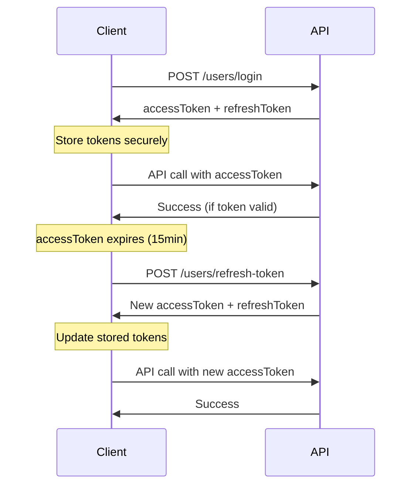

# 🔄 Refresh Token Implementation Guide

## Overview

This authentication system uses a **stateless refresh token approach** with JWT tokens that have different expiry times for enhanced security and user experience.

## 🚀 Token Strategy

### Access Tokens

- **Purpose**: Short-lived tokens for API access
- **Expiry**: 15 minutes
- **Usage**: All protected endpoints
- **Storage**: Memory/sessionStorage (not localStorage)

### Refresh Tokens

- **Purpose**: Long-lived tokens to get new access tokens
- **Expiry**: 7 days
- **Usage**: Only for token refresh endpoint
- **Storage**: Secure httpOnly cookies (recommended) or secure storage

## 🔐 Security Features

✅ **Short Access Token Lifespan** - Reduces attack window  
✅ **Stateless Design** - No database overhead  
✅ **Token Rotation** - New refresh token on each refresh  
✅ **JWT Signing** - Cryptographically secure  
✅ **Type Validation** - Refresh tokens marked with type field

## 📋 API Endpoints

### 1. User Login

**`POST /api/v2/users/login`**

Returns both access and refresh tokens.

```json
{
  "email": "user@example.com",
  "password": "SecurePassword123!"
}
```

**Response:**

```json
{
  "user": {
    "id": 1,
    "name": "John Doe",
    "email": "user@example.com",
    "createdAt": "2024-01-01T00:00:00.000Z",
    "updatedAt": "2024-01-01T00:00:00.000Z"
  },
  "accessToken": "eyJhbGciOiJIUzI1NiIsInR5cCI6IkpXVCJ9...",
  "refreshToken": "eyJhbGciOiJIUzI1NiIsInR5cCI6IkpXVCJ9..."
}
```

### 2. Refresh Token

**`POST /api/v2/users/refresh-token`**

Get new tokens using refresh token.

```json
{
  "refreshToken": "eyJhbGciOiJIUzI1NiIsInR5cCI6IkpXVCJ9..."
}
```

**Response:**

```json
{
  "user": { ... },
  "accessToken": "NEW_ACCESS_TOKEN",
  "refreshToken": "NEW_REFRESH_TOKEN"
}
```

## 🔧 Implementation Details

### JWT Service Methods

```typescript
// Generate token pair
const tokens = jwtService.generateTokenPair(payload);
// Result: { accessToken: "...", refreshToken: "..." }

// Verify access token
const payload = jwtService.verifyToken(accessToken);

// Verify refresh token
const payload = jwtService.verifyRefreshToken(refreshToken);
```

### Token Structure

**Access Token:**

```json
{
  "userId": 1,
  "email": "user@example.com",
  "iat": 1234567890,
  "exp": 1234568790 // 15 minutes later
}
```

**Refresh Token:**

```json
{
  "userId": 1,
  "email": "user@example.com",
  "type": "refresh", // Identifies as refresh token
  "iat": 1234567890,
  "exp": 1234972690 // 7 days later
}
```

## 🌊 Authentication Flow



## 💻 Client Implementation

### JavaScript/TypeScript Example

```typescript
class AuthService {
  private accessToken: string | null = null;
  private refreshToken: string | null = null;

  async login(email: string, password: string) {
    const response = await fetch("/api/v2/users/login", {
      method: "POST",
      headers: { "Content-Type": "application/json" },
      body: JSON.stringify({ email, password }),
    });

    const data = await response.json();
    this.accessToken = data.accessToken;
    this.refreshToken = data.refreshToken;

    return data;
  }

  async apiCall(url: string, options: RequestInit = {}) {
    // Try with current access token
    let response = await this.makeRequest(url, options);

    // If 401, try to refresh token
    if (response.status === 401 && this.refreshToken) {
      const refreshed = await this.refreshTokens();
      if (refreshed) {
        response = await this.makeRequest(url, options);
      }
    }

    return response;
  }

  private async makeRequest(url: string, options: RequestInit) {
    return fetch(url, {
      ...options,
      headers: {
        ...options.headers,
        Authorization: `Bearer ${this.accessToken}`,
      },
    });
  }

  private async refreshTokens(): Promise<boolean> {
    if (!this.refreshToken) return false;

    try {
      const response = await fetch("/api/v2/users/refresh-token", {
        method: "POST",
        headers: { "Content-Type": "application/json" },
        body: JSON.stringify({ refreshToken: this.refreshToken }),
      });

      if (response.ok) {
        const data = await response.json();
        this.accessToken = data.accessToken;
        this.refreshToken = data.refreshToken;
        return true;
      }
    } catch (error) {
      console.error("Token refresh failed:", error);
    }

    // Refresh failed - redirect to login
    this.logout();
    return false;
  }

  logout() {
    this.accessToken = null;
    this.refreshToken = null;
    // Redirect to login page
  }
}
```

## 🛡️ Security Best Practices

### Client-Side Storage

1. **Access Token**: Store in memory or sessionStorage
2. **Refresh Token**: Store in secure httpOnly cookies (preferred) or encrypted localStorage
3. **Never store in regular localStorage** for production apps

### Token Handling

1. **Automatic Refresh**: Implement interceptors to auto-refresh on 401 errors
2. **Token Rotation**: Always use new refresh token from refresh response
3. **Secure Transmission**: Always use HTTPS in production
4. **XSS Protection**: Don't store tokens in accessible JavaScript variables

### Server Configuration

```typescript
// Example: Set refresh token as httpOnly cookie
res.cookie("refreshToken", refreshToken, {
  httpOnly: true,
  secure: process.env.NODE_ENV === "production",
  sameSite: "strict",
  maxAge: 7 * 24 * 60 * 60 * 1000, // 7 days
});
```

## 🧪 Testing

### Manual Testing

```bash
# 1. Login
curl -X POST http://localhost:3001/api/v2/users/login \
  -H "Content-Type: application/json" \
  -d '{"email": "user@example.com", "password": "password"}'

# 2. Use access token
curl -X GET http://localhost:3001/api/v2/users/1 \
  -H "Authorization: Bearer ACCESS_TOKEN"

# 3. Refresh tokens
curl -X POST http://localhost:3001/api/v2/users/refresh-token \
  -H "Content-Type: application/json" \
  -d '{"refreshToken": "REFRESH_TOKEN"}'
```

### Automated Testing

- Test token expiry scenarios
- Test refresh token rotation
- Test invalid token handling
- Test concurrent refresh requests

## ⚙️ Configuration

### Environment Variables

```bash
JWT_SECRET=your-super-secure-secret-key-here
```

### Token Expiry Settings

Located in `src/services/jwtService.ts`:

```typescript
const ACCESS_TOKEN_EXPIRES_IN = "15m"; // Customize as needed
const REFRESH_TOKEN_EXPIRES_IN = "7d"; // Customize as needed
```

## 🔄 Migration from Previous System

If migrating from the previous single-token system:

1. **Client Code**: Update to handle `accessToken` and `refreshToken` fields
2. **API Calls**: Implement automatic token refresh logic
3. **Storage**: Move to secure storage for refresh tokens
4. **Error Handling**: Add 401 retry logic with token refresh

## 📝 Additional Notes

- **No Database Overhead**: All token validation is stateless
- **Horizontal Scaling**: Works perfectly in distributed systems
- **Token Revocation**: Not supported (by design for simplicity)
- **Session Management**: Use short access token expiry for security
- **Performance**: Excellent due to stateless nature

## 🆘 Troubleshooting

### Common Issues

1. **"Invalid refresh token"**

   - Check token format and expiry
   - Ensure refresh token has `type: "refresh"` field

2. **"Access token expired"**

   - Implement automatic refresh in client
   - Check system clock synchronization

3. **"Token rotation not working"**
   - Always use the new refresh token from response
   - Don't reuse old refresh tokens

### Debug Commands

```bash
# Decode JWT token (without verification)
echo "TOKEN" | cut -d'.' -f2 | base64 -d

# Check token expiry
node -e "console.log(new Date(JSON.parse(Buffer.from('PAYLOAD', 'base64')).exp * 1000))"
```
